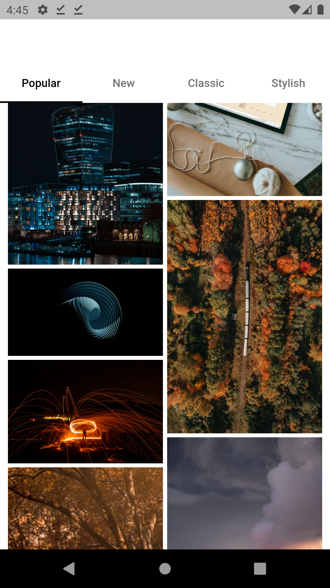

# Flutter UI Design Day 31 40

## Development Setup
Clone the repository and run the following commands:
```
flutter pub get
flutter run
```

# ScreenShot


## Day 31 - Github API Example


## Day 32 - Concentric Transition Package
&nbsp;

## Day 33 - Select Image
&nbsp;

## Day 34 - Winter Collection List


## Day 35 - PageView and ScaleTransitio
"/>&nbsp;

## Day 36 - Register with Phone Number
&nbsp;&nbsp;


## Day 37 - Discover Page UI
&nbsp;

## Day 38 - Selectable ListView
&nbsp;

## Day 39 - Flutter UI Design


## Day 40 - Onboarding Page

